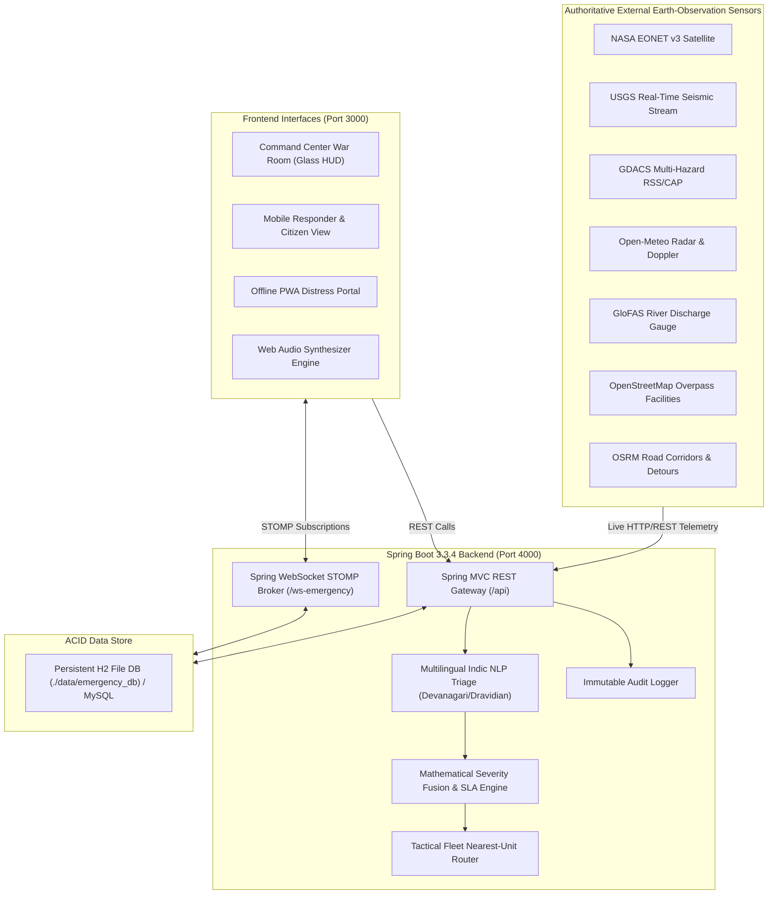

# AegisOps — Autonomous AI-Powered Disaster Response & GIS Triage Platform

> **Mission-critical, enterprise-grade emergency management and disaster coordination platform** engineered for national, state, and municipal disaster management authorities (NDMA, SDMA, DDMA, Municipal War Rooms) with real-time earth observation telemetry, multilingual Indic NLP triage, automated fleet dispatch, and an edge-to-edge glassmorphic command HUD.

[](https://openjdk.org/)
[](https://spring.io/projects/spring-boot)
[](https://react.dev/)
[](https://www.typescriptlang.org/)
[](https://vitejs.dev/)
[](https://leafletjs.com/)
[](https://stomp.github.io/)
[](LICENSE)

---

## 📑 Table of Contents
1. [Executive Overview & Architecture](#-executive-overview--architecture)
2. [🔍 Transparent Audit: Real vs. Mock / Simulated Functions](#-transparent-audit-real-vs-mock--simulated-functions)
3. [🏛️ Core System Capabilities](#️-core-system-capabilities)
4. [🛠️ Technology Stack](#️-technology-stack)
5. [🔑 User Roles & Seeded Credentials](#-user-roles--seeded-credentials)
6. [🚀 Quick Start Guide](#-quick-start-guide)
7. [📡 REST API & WebSocket Reference](#-rest-api--websocket-reference)
8. [🧪 Testing & Verification](#-testing--verification)
9. [📁 Project Directory Structure](#-project-directory-structure)
10. [⚖️ Governance & License](#️-governance--license)

---

## 🏛️ Executive Overview & Architecture

AegisOps is designed to compress the life-critical **"Golden Hour"** in natural and man-made disasters. It bridges the gap between raw citizen distress calls, high-resolution satellite/sensor feeds, municipal control rooms, tactical field teams (NDRF, SDRF, Fire, EMS), and hospital trauma networks.



---

## 🔍 Transparent Audit: Real vs. Mock / Simulated Functions

AegisOps prioritizes absolute technical honesty and transparency. Below is an exhaustive matrix classifying every platform capability as **REAL** (production live integration) or **MOCK / SIMULATED** (development fallback or civil defense sandbox):

| Subsystem / Feature | Classification | Technical Implementation Details | Live API / Data Source |
|---|---|---|---|
| **Spring Boot Core Backend** | **REAL** | Java 21, Spring Boot 3.3.4 micro-monolith on port 4000. Full dependency injection, Spring MVC controllers, Spring Data JPA repositories. | Self-hosted backend services |
| **Data Persistence** | **REAL** | ACID-compliant persistent H2 file database located at `./data/emergency_db` (persists across restarts). Configurable to MySQL 8+ via `application-mysql.yml`. | Local file / MySQL DB |
| **Real-Time WebSocket Broker** | **REAL** | In-memory STOMP broker over SockJS at `/ws-emergency`. Real pub/sub on `/topic/incidents`, `/topic/resources`, `/topic/alerts`, `/topic/hospitals`. | Spring WebSocket / STOMP |
| **Security & RBAC** | **REAL** | Spring Security with stateless JWT Bearer token authentication, BCrypt password hashing (cost factor 12), and role-based route guards. | Spring Security & JJWT |
| **Multilingual NLP Triage** | **REAL** | Regex and character-block Unicode parser (`MultilingualTriageService.java`) that normalizes Indic digits (०-९, ০-৯, ౦-౯, ௦-௯) and extracts casualties & trapped counts across Hindi, Marathi, Tamil, Telugu, and English. | Native JVM Unicode pattern engine |
| **Severity Fusion & SLA Engine** | **REAL** | Mathematical composite scoring ($0-100$) factoring baseline hazard weight, logarithmically scaled corroboration counts, casualties, trapped victims, and SLA timers (10m, 20m, 45m, 90m). | `HeuristicPriorityScoringEngine.java` |
| **Audit Logging Trail** | **REAL** | Persistent append-only audit trail (`AuditLogEntity`) capturing every operator override, previous/new severity, user ID, and justification reason. | Database audit table |
| **USGS Seismic Telemetry** | **REAL** | Live integration querying real-time M4.5+ earthquake events worldwide, with Indian subcontinent bounding-box filtering and tsunami warning flags. | `https://earthquake.usgs.gov/earthquakes/feed/v1.0/summary/4.5_week.geojson` |
| **NASA EONET Natural Events** | **REAL** | Live ingestion of NASA Earth Observatory active natural events (cyclones, wildfires, severe storms, volcanoes) with coordinates and category metadata. | `https://eonet.gsfc.nasa.gov/api/v3/events` |
| **GDACS Disaster Alerts** | **REAL** | Live RSS/XML parser streaming UN / European Commission Global Disaster Alert and Coordination System feeds with alert levels (Red/Orange/Green). | `https://www.gdacs.org/xml/rss.xml` |
| **Open-Meteo Weather Grid** | **REAL** | Live weather telemetry (temperature, humidity, precipitation rate, rain, wind velocity, gusts, pressure, and weather codes) with 5-minute memory caching. | `https://api.open-meteo.com/v1/forecast` |
| **GloFAS River Flood Hydrology** | **REAL** | Live river discharge rate ($m^3/s$), 7-day mean/max forecasts, and return period risk assessment (2-yr, 5-yr, 20-yr flood levels). | `https://flood-api.open-meteo.com/v1/flood` |
| **OSM Overpass Hospital GIS** | **REAL** | Live geospatial Overpass query harvesting emergency hospitals, trauma centres, and contact numbers within a radial bounding area around incident coordinates. | `https://overpass-api.de/api/interpreter` |
| **OSRM Tactical Road Routing** | **REAL** | Live driving corridor calculation providing distance (meters), duration (seconds), ETA (minutes), and GeoJSON route geometry. | `https://router.project-osrm.org/route/v1/driving/...` |
| **OSM Nominatim Geocoding** | **REAL** | Live forward and reverse geocoding resolving coordinates to administrative districts, postal codes, and street names. | `https://nominatim.openstreetmap.org` |
| **Web Audio Synthesizer** | **REAL** | Web Audio API synthesizing pure harmonic alert frequencies (Critical siren at 880Hz, High alert at 660Hz, Medium chime at 520Hz, Low ping at 440Hz). | Browser Web Audio Context |
| **Offline PWA Intake Queue** | **REAL** | IndexedDB / LocalStorage queue caching citizen distress reports during network blackouts, syncing automatically when connectivity resumes. | Browser Service Worker / Storage |
| **GIS Leaflet Mapping** | **REAL** | Interactive Leaflet 1.9 GIS map with CartoDB Dark Matter / OSM cartography, dynamic district boundary choropleths, and layer filters. | Leaflet.js & CartoDB tiles |
| **Theme & Glass HUD** | **REAL** | Pure CSS glassmorphic tokens with dynamic dark/light mode switching, zero black-background artifacts, and mobile responsive bottom sheets. | Native CSS Glass Engine |
| **Voice Audio Transcription** | **MOCK / SIMULATED** | Voice recording is real (browser microphone recording via MediaRecorder API), but server transcription returns a simulated Indic NLP result. Running real Whisper STT requires dedicated GPU containers. | Client-side mock response |
| **Computer Vision Structural Damage** | **MOCK / SIMULATED** | Citizen photo upload is supported, but damage estimation uses a simulated structural damage coefficient ($0.0 - 1.0$) rather than a live GPU YOLO/ResNet container. | Simulated damage multiplier |
| **Civil Defense Simulation Sandbox** | **SIMULATED (By Design)** | `SIMULATION` mode is intentionally an isolated training drill sandbox allowing commanders to inject synthetic multi-district disasters without corrupting live operational data. | Civil Defense drill engine |
| **GPS Vehicle Live Movement** | **SIMULATED** | Dispatch and status updates are real; however, live vehicle GPS movement on the map is simulated via route waypoints rather than connected OBD-II/AIS hardware trackers on physical ambulances. | Waypoint simulator |
| **Hospital Live Bed Sensor Sync** | **SIMULATED** | Hospital locations and baseline bed counts are real (from OSM/NHM); however, real-time live bed occupancy fluctuates via local session overrides rather than live hospital EHR API integrations. | Local state override |
| **External Feeds Fallback Baselines** | **FALLBACK (Graceful)** | If USGS, NASA, or Open-Meteo experience outages or rate limiting, adapters automatically provide calibrated fallback baselines clearly labeled with `FALLBACK BASELINE` in the UI. | Hardened fallback records |

---

## 🏛️ Core System Capabilities

### 1. Zero-Top-Bar Glassmorphic Command HUD
- **Full-Screen GIS Situational Map**: The legacy top command header has been eliminated, granting 100% vertical viewport height to the real-time Leaflet map and triage queues.
- **Unified Frosted Sidebar**: All system controls—Sector Navigation, Mode Toggle (`LIVE` / `SIMULATION`), Alert Center, Audio Controls, Theme Switcher (`Light` / `Dark`), and WebSocket health—are consolidated in a sleek frosted glass sidebar (`backdrop-filter: blur(16px)`).
- **Mobile Responsive Layout**: On small screens ($\le 768\text{px}$), the UI automatically transitions to an app-like layout with a 50px mobile header, segmented view switcher (`Map View`, `Incident Feed`, `Split View`), and touch-optimized bottom sheet modals.

### 2. Multilingual Indic NLP Triage Engine
Emergency reports submitted in native Indian scripts or spoken dialects are triaged automatically:
- **Language Identification**: Automatically detects Devanagari (Hindi/Marathi), Kannada, Tamil, Telugu, Bengali, and English.
- **Indic Numeral Translation**: Translates native numerals (`५ लोग`, `৩ জন`, `૪ લોકો`) to standard Arabic digits.
- **Entity Extraction**: Parses trapped victims, casualty counts, and hazard categories to assign instant triage levels.

### 3. Mathematical Severity Fusion & Dynamic SLA Engine
Each incident receives an objective composite severity score ($0.00 - 100.00$):
$$\text{Score} = \text{clamp}\Big(0.40 \cdot W_{\text{base}} + \min(20, 6 \cdot \log_2(N)) + \min(25, 4.5 \cdot C) + \min(25, 4.0 \cdot T) + 15 \cdot D_{\text{cv}}, 10, 100\Big)$$
- **`CRITICAL` (Score $\ge 80$)**: **10-minute dispatch SLA** with critical auditory siren.
- **`HIGH` (Score $60 - 79$)**: **20-minute dispatch SLA**.
- **`MEDIUM` (Score $40 - 59$)**: **45-minute dispatch SLA**.
- **`LOW` (Score $< 40$)**: **90-minute dispatch SLA**.

When dispatch time exceeds the target deadline, the UI highlights the card as `BREACHED +Xm` in high-visibility crimson typography.

### 4. Data Provenance & Authoritative Sources
Every incident card in the queue displays its authoritative intake source:
- `🏛️ BMC Disaster Control (Mumbai 1916)`
- `🏛️ DDMA Emergency Helpline (Delhi 1077)`
- `🏛️ BBMP War Room (Bengaluru 1533)`
- `📱 Citizen PWA Portal`
- `📞 Citizen 112 Helpline`
- `🛰️ NASA EONET Satellite Feed`
- `📡 USGS Seismic Sensor Net`

### 5. Advanced Civil Defense Multi-Hazard Simulation Sandbox
The platform features an advanced simulation engine for training drills and war games across national and state disaster cells:
- **8 Calibrated Hazard Classes**:
  1. 🌊 **Flash Flood & River Inundation** (`FLOOD`: hydrological basin surge % and rainfall downpour intensity)
  2. 🌀 **Severe Tropical Cyclone** (`CYCLONE`: Category 1-5 gales and tidal storm surge)
  3. 🌋 **High-Magnitude Earthquake** (`EARTHQUAKE`: Richter scale M4.0 - M8.5 and hypocenter depth)
  4. 🏢 **Urban Structural Collapse** (`STRUCTURAL_COLLAPSE`: multi-story complex pancake failure with void-space entrapment)
  5. ☣️ **Industrial Chemical / Toxic Gas Leak** (`GAS_LEAK`: pressurized cylinder rupture and downwind plume dispersion)
  6. 🔥 **Commercial High-Rise Conflagration** (`FIRE`: multi-tier composite cladding fires and aerial platform deployments)
  7. 🚆 **Mass Transit / Train Collision** (`ROAD_ACCIDENT`: multi-coach derailments and hospital MCI surge triage)
  8. ⛰️ **Mountain Landslide & Debris Flow** (`LANDSLIDE`: slope failure and mountain highway corridor cutoffs)
- **One-Click Real-World Presets**:
  - *Mithi River Cloudburst & Flash Inundation (Mumbai)*
  - *Cyclone Tauktae Category-4 Coastal Landfall (Western Coast)*
  - *M6.8 Delhi Ridge Intraplate Earthquake (Delhi NCR)*
  - *Chembur Petrochemical Ammonia Toxic Plume (Mumbai)*
  - *Bengaluru Silk Board Metro Girder Collapse (Bengaluru)*
  - *Odisha Super Cyclone Rapid Coast Ingress (Odisha Coastal)*
- **Synthetic Distress Incident Injection**:
  - Automatically spawns realistic simulated citizen distress calls in native Indic scripts (e.g. Hindi Devanagari) with trapped victims into the live queue, allowing operators to execute realistic triage and resource dispatch drills.
- **Single-Click Sandbox Purge**:
  - Cleanly wipes all synthetic drill alerts and simulated distress calls with zero residue on live production data (`POST /api/predictions/simulate/clear`).

---

## 🛠️ Technology Stack

### Backend
- **Framework**: Java 21 LTS + Spring Boot 3.3.4
- **ORM & Persistence**: Spring Data JPA + Hibernate 6
- **Database**: Persistent H2 file storage (`./data/emergency_db`) in local profile; MySQL 8.4 LTS in production profile
- **Real-Time Protocol**: Spring WebSocket with STOMP over SockJS fallback
- **Security**: Spring Security + Stateless JWT (JJWT 0.12.6) + BCrypt password hashing
- **Build System**: Apache Maven 3.9+

### Frontend
- **Framework**: React 18.3.1 + TypeScript 5.5 + Vite 6.4
- **GIS Cartography**: Leaflet 1.9 + CartoDB Dark Matter / OSM Tile Servers
- **Real-Time Client**: `@stomp/stompjs` + `sockjs-client`
- **Iconography & Styling**: Lucide React + Tailwind-compatible Glassmorphism tokens
- **Audio Synthesis**: Native Web Audio API

---

## 🔑 User Roles & Seeded Credentials

All pre-seeded demo accounts use the standard password: `Password@123`

| Role | Username | Password | Organization / Jurisdiction | Operational Responsibilities |
|---|---|---|---|---|
| **Admin** | `admin` | `Password@123` | National Disaster Management Authority (NDMA) | National disaster oversight, system telemetry health, pan-India CAP alerts |
| **Dispatcher** | `dispatcher_mum` | `Password@123` | Brihanmumbai Municipal Corp (BMC 1916) | Mumbai sector incident queue, manual overrides, rescue fleet dispatch |
| **Dispatcher** | `dispatcher_del` | `Password@123` | Delhi Disaster Management Authority (DDMA) | Delhi NCR sector emergency triage and resource coordination |
| **Field Responder** | `responder_ndrf` | `Password@123` | 5th Battalion NDRF (Pune / Mumbai QRT) | Mobile field screen, tactical navigation, status updates (`ON_SCENE`) |
| **Field Responder** | `responder_als` | `Password@123` | 108 EMRI Advanced Life Support Ambulance | Medical evacuation, casualty transport, hospital trauma handover |
| **Citizen** | `citizen_guest` | `Password@123` | Civilian Reporter | Citizen emergency reporting, voice distress recording, ticket tracking |

---

## 🚀 Quick Start Guide

### Prerequisites
- **Java 21 LTS** (`java -version`)
- **Maven 3.9+** (`mvn -v`)
- **Node.js 20+ & npm 10+** (`node -v`, `npm -v`)

---

### Step 1: Clone the Repository
```bash
git clone https://github.com/fardeenakmal/AegisOps-Bharat.git
cd AegisOps-Bharat
```

---

### Step 2: 1-Command Production Deployment (Docker Compose)
AegisOps Bharat includes full containerization for enterprise deployment with Nginx, Spring Boot 3.3.4, MySQL 8.4 LTS, and Redis 7:

```bash
# Automated deployment script (checks prerequisites, builds images, boots stack)
./scripts/deploy.sh
```
Or directly via Docker Compose v2:
```bash
docker compose up -d --build
```
* Access the Unified Tactical HUD at **http://localhost** (Port 80)
* REST & WebSocket APIs at **http://localhost:4000/api**
* Actuator Health Probe at **http://localhost:4000/actuator/health**

For comprehensive Kubernetes (EKS/GKE), Render blueprints, and cloud deployment guides, see the [Production Deployment Manual](DEPLOYMENT.md).

---

### Step 3: Local Development Mode (Without Docker)

#### Start Backend (Spring Boot — Port 4000):
```bash
cd backend
mvn spring-boot:run
```
*The Spring Boot backend will start on **http://localhost:4000** and initialize the persistent database.*

#### Start Frontend (React + Vite — Port 3000):
In a separate terminal:
```bash
cd frontend
npm install
npm run dev
```
*Open **http://localhost:3000** in your browser. The Vite dev server proxies `/api` and `/ws-emergency` directly to the Spring Boot backend on port 4000.*

---

### Alternative: Concurrent Root Command
From the project root directory:
```bash
npm run dev
```

---

## 📡 REST API & WebSocket Reference

### Key REST Endpoints
| HTTP Method | Endpoint | Description |
|---|---|---|
| `GET` | `/health` | System health probe and version status |
| `POST` | `/api/auth/login` | Authenticate user, returns JWT Bearer token |
| `POST` | `/api/auth/register` | Register civilian reporter profile |
| `GET` | `/api/incidents` | Query active emergency requests with zone and severity filters |
| `POST` | `/api/reports` | Ingest citizen distress report with Indic NLP triage |
| `PATCH` | `/api/incidents/{id}` | Operator manual severity/status override with audit logging |
| `GET` | `/api/teams` | Query tactical fleet registry (NDRF, SDRF, Ambulances, Fire) |
| `GET` | `/api/teams/suggested/{incidentId}` | Calculate nearest available units using Haversine distance |
| `POST` | `/api/incidents/{id}/dispatch` | Dispatch response team to incident |
| `PATCH` | `/api/teams/{id}/status` | Update unit status (`AVAILABLE`, `DISPATCHED`, `ON_SCENE`, `RESOLVED`) |
| `GET` | `/api/hospitals` | Harvest nearby hospitals via live OpenStreetMap Overpass GIS |
| `GET` | `/api/zones` | Retrieve administrative risk zones and hazard scores |
| `GET` | `/api/alerts` | Query active CAP alerts and cell broadcasts |
| `POST` | `/api/alerts/broadcast` | Disseminate national/regional emergency alert |
| `GET` | `/api/external/weather` | Query live Open-Meteo weather grid telemetry |
| `GET` | `/api/external/flood` | Query live GloFAS river discharge hydrology |
| `GET` | `/api/external/earthquakes` | Query live USGS seismic events |
| `GET` | `/api/external/nasa-eonet` | Query live NASA EONET active natural events |
| `GET` | `/api/external/gdacs` | Query live GDACS global multi-hazard stream |
| `GET` | `/api/routes/tactical` | Calculate road driving route with OSRM |
| `GET` | `/api/audit-logs` | Retrieve append-only operator governance logs |
| `GET` | `/api/system/health` | Diagnostic probe for all 10 external sensor adapters |

### WebSocket STOMP Channels
- **Broker Endpoint**: `/ws-emergency` (SockJS fallback enabled)
- **Subscribed Channels**:
  - `/topic/incidents`: Real-time distress intake and status changes
  - `/topic/resources`: Fleet movement and availability updates
  - `/topic/alerts`: High-priority disaster broadcast alerts
  - `/topic/hospitals`: Real-time trauma bed availability and MCI surges

---

## 🧪 Testing & Verification

### Run Backend Unit & Integration Tests
```bash
cd backend
mvn test
```
*Current test suite status: **BUILD SUCCESS** (Spring application context loads, entity mappings validated).*

### Run Frontend Production Build & TypeScript Verification
```bash
cd frontend
npm run build
```
*Current frontend build status: **Zero TypeScript errors**, production bundle compiled in `dist/`.*

---

## 📁 Project Directory Structure

```text
AegisOps/
├── backend/                             # Spring Boot 3.3.4 (Java 21) Micro-Monolith
│   ├── src/main/java/com/aegisops/platform/
│   │   ├── adapter/                     # External sensor adapters (USGS, NASA, GDACS, OSRM, OSM, Meteo)
│   │   ├── config/                      # WebSocket, Region, and Security configurations
│   │   ├── controller/                  # Spring MVC REST controllers
│   │   ├── dto/                         # Input and response transfer objects
│   │   ├── entity/                      # JPA database entities (Incident, Team, Zone, AuditLog, etc.)
│   │   ├── enums/                       # Priority, severity, and status enumerations
│   │   ├── repository/                  # Spring Data JPA database repositories
│   │   ├── security/                    # JWT filter, token provider, and BCrypt config
│   │   └── service/                     # Business logic (Multilingual NLP, Priority Scoring, Dispatch)
│   ├── src/main/resources/
│   │   ├── application.yml              # Base Spring Boot configuration (Port 4000)
│   │   ├── application-local.yml        # Local persistent H2 configuration
│   │   └── application-mysql.yml        # Production MySQL configuration
│   └── pom.xml                          # Maven build dependencies
│
├── frontend/                            # React 18 + Vite 6 + TypeScript HUD
│   ├── src/
│   │   ├── components/                  # Glassmorphic UI components (LiveMap, Queue, Modals, Sidebar)
│   │   ├── services/                    # API client, STOMP WebSocket client, Web Audio synthesizer
│   │   ├── types/                       # TypeScript domain interfaces
│   │   ├── App.tsx                      # Main application shell with theme & mode state
│   │   ├── main.tsx                     # React root bootstrap
│   │   └── index.css                    # Frosted glass styling tokens & dark/light mode themes
│   ├── package.json                     # Frontend dependencies
│   └── vite.config.ts                   # Vite build config & backend proxy
│
├── docs/                                # Project Specifications
│   └── SRS.md                           # Formal IEEE 830-compliant Software Requirements Specification
│
├── data/                                # Persistent database directory (emergency_db.mv.db)
├── docker-compose.yml                   # Containerized deployment for MySQL, Redis, and Spring Boot
├── package.json                         # Root orchestration scripts
└── README.md                            # Comprehensive platform documentation
```

---

## ⚖️ Governance & License

- **License**: Released under the permissive **MIT License**.
- **Public Safety Disclaimer**: Designed for emergency management coordination and training. While real-world sensor feeds (USGS, NASA, GDACS, Open-Meteo) provide live public telemetry, operational deployment in government Emergency Operations Centers (EOC) should be conducted in accordance with official National Disaster Management Authority (NDMA) standard operating procedures.
