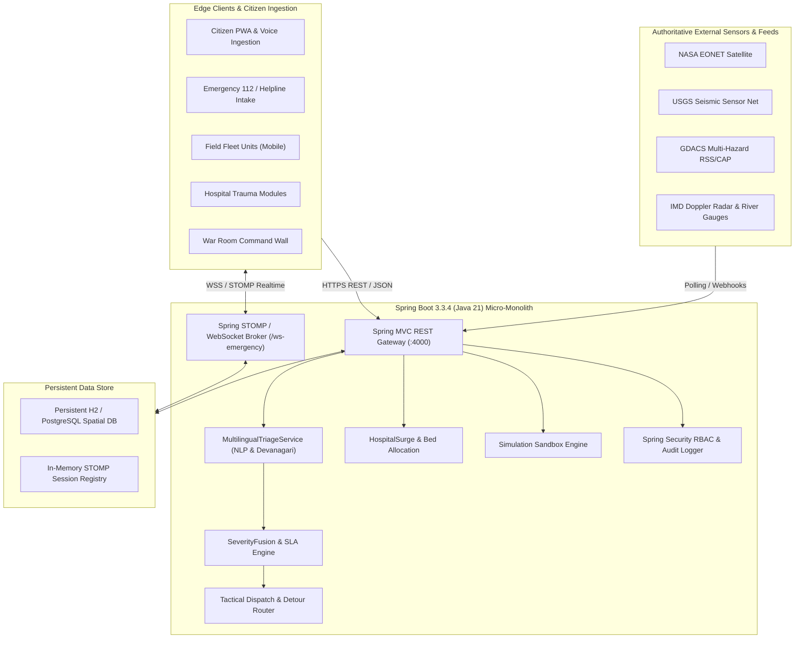
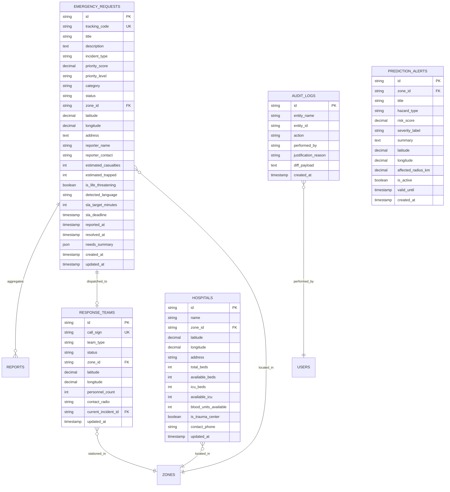

# AegisOps Software Requirements Specification (SRS)

**Document Reference**: `AEGISOPS-SRS-2026-V2`  
**System**: AegisOps Bharat — Autonomous AI-Powered Multi-Agency Emergency Disaster Response & GIS Triage Platform  
**Standard**: IEEE Std 830-1998 / ISO/IEC/IEEE 29148:2018 Compliant Specification  
**Version**: 2.0.0-PROD (Spring Boot 3.3.4 + React 18 Production Edition)  
**Status**: APPROVED / IN OPERATION  
**Classification**: National Critical Infrastructure / Civil Defense Operational Spec  

---

## 1. Introduction & Executive Overview

### 1.1 Purpose
This Software Requirements Specification (SRS) establishes the definitive functional, architectural, operational, and non-functional requirements for the **AegisOps Bharat Disaster Coordination Platform**. It serves as the formal contractual and engineering baseline for software architects, backend Java engineers, frontend React developers, control room dispatchers, and state/national civil defense authorities (NDMA, SDMA, DDMA, 112 Command Centers).

### 1.2 Scope of the System
AegisOps is a mission-critical, enterprise-grade, multi-agency disaster coordination platform designed to drastically compress the critical "golden hour" between hazard occurrence, citizen distress intake, and emergency resource dispatch. The platform integrates:
1. **Multi-Channel Intake**: Citizen Web/PWA, Emergency 112 Voice Helpline, Municipal Helplines (BMC 1916, DDMA 1077, BBMP 1533), and automated messaging bots.
2. **Multilingual AI Triage**: Real-time Natural Language Processing (NLP) across English and Indian regional languages (Hindi, Marathi, Kannada, Tamil, Bengali) extracting casualties, entrapment, and structured equipment needs.
3. **Multi-Modal Severity Fusion**: Mathematical severity scoring ($0 - 100$) dynamically driving SLA dispatch deadlines.
4. **Geospatial GIS & Open Earth Observation Feeds**: Real-time integration with NASA EONET v3, USGS Seismic Networks, GDACS, IMD Doppler Weather Radar, and OpenStreetMap infrastructure telemetry.
5. **Tactical Fleet & Hospital MCI Surge Management**: Automated nearest-responder dispatch vectors and dynamic trauma bed allocation.
6. **Full Glassmorphic Interface & Zero-Top-Bar Immersive HUD**: High-contrast, theme-adaptive dark/light glassmode optimized for large war room wall screens down to mobile hand-held responder devices.

### 1.3 Document Conventions
- **MUST / SHALL / REQUIRED**: Mandatory core requirements for production release.
- **SHOULD / RECOMMENDED**: Highly desirable requirements for operational efficiency.
- **MAY / OPTIONAL**: Non-blocking feature extensions.

### 1.4 References
- IEEE Std 830-1998: *Recommended Practice for Software Requirements Specifications*.
- ISO/IEC/IEEE 29148:2018: *Systems and Software Engineering — Life Cycle Processes — Requirements Engineering*.
- National Disaster Management Authority (NDMA) Standard Operating Procedures for Emergency Operations Centers (EOC).
- Common Alerting Protocol (CAP v1.2) ITU-T Recommendation X.1303.
- Open Geospatial Consortium (OGC) Standards for Web Map Tile Services & GeoJSON.
- RFC 6455: *The WebSocket Protocol* & STOMP v1.2 Specification.

---

## 2. Overall System Description & High-Level Architecture

### 2.1 Product Perspective
AegisOps operates as a unified Disaster Intelligence command system interfacing between external earth-observation sensor networks, municipal municipal bodies, on-scene emergency responders, and hospital trauma centers.

### 2.2 Operational User Roles (RBAC)

| Role ID | Display Name | Access Privileges |
|---|---|---|
| `CITIZEN` | Public Citizen / Guest | Submit emergency reports, track tracking code status, record voice distress audio, view public alerts. |
| `CONTROL_ROOM_OPERATOR` | 112 EOC Operator | Full read/write triage queue, manual severity overrides, assign rescue fleet units, log audio chimes. |
| `RESCUE_RESPONDER` | Tactical Unit Lead | View assigned dispatch orders, update status (`EN_ROUTE`, `ON_SCENE`, `RESOLVED`), report field telemetry. |
| `HOSPITAL_ADMIN` | Trauma Bed Director | Update ICU/trauma bed capacities, manage triage tiers (Red/Yellow/Green), trigger Mass Casualty Incident (MCI) surge. |
| `STATE_COMMANDER` | State Disaster Chief | Cross-district resource reallocation, state rollup view, approve mutual aid between zones. |
| `NATIONAL_COMMANDER` | NDMA Director General | Pan-India National Grid oversight, inject multi-district civil defense simulation drills, broadcast CAP alerts. |
| `SYSTEM_ADMIN` | Platform Reliability Eng | Telemetry health monitoring, audit logs inspection, external feeds sync configuration. |

### 2.3 Operating Environment
- **Server Platform**: Linux (Ubuntu 22.04 LTS / Debian 12 / Alpine), containerized via Docker.
- **Java Runtime**: Eclipse Temurin OpenJDK 21.0.4+ LTS.
- **Backend Framework**: Spring Boot 3.3.4 with Spring Data JPA, Spring WebSocket (STOMP), Spring Security.
- **Client Runtime**: Modern evergreen browsers (Chrome 110+, Firefox 115+, Safari 16+, Edge 110+) with WebGL and Service Worker support.
- **Frontend Framework**: React 18.3.1, TypeScript 5.5, Vite 6.4, Leaflet GIS 1.9, Lucide React icons.

---

## 3. External Interface Requirements

### 3.1 User Interfaces

#### 3.1.1 Full-Screen Immersive War Room (Zero Top Bar)
- **Zero-Top-Bar Specification**: The application viewport SHALL eliminate the legacy top command header to maximize the vertical viewing area for GIS map situational awareness and emergency request queues.
- **Sidebar Integration**: All mission controls—Operational Sector/Zone selector (Pan-India, Mumbai, Delhi, Bengaluru, Chennai, Odisha, Kolkata), Mode toggle (`LIVE` / `SIMULATION`), Navigation, Emergency Actions, Theme Switcher (`Light` / `Dark`), Audio Mute, and WebSocket live status—SHALL reside within the collapsible frosted glass sidebar (`Sidebar.tsx`).
- **Glassmode Design System**: All surfaces (sidebar, panels, cards, modals, floating HUD pills) SHALL implement translucent glassmorphism with `backdrop-filter: blur(16px) saturate(180%)`, theme-aware specular borders (`rgba(255,255,255,0.08)` to `rgba(255,255,255,0.85)`), and layered ambient box shadows.

#### 3.1.2 Emergency Request Queue & Data Provenance
- **Queue Panel Layout**: The queue SHALL feature an unwrap-proof header displaying the title, live badge counter, and refresh button on row 1, with the triage subtext on row 2.
- **Data Provenance & Source of Information**: Each emergency request card in the queue SHALL explicitly render an authoritative provenance badge:
  - Source channel / agency icon: `🏛️ BMC Disaster Control (Mumbai 1916)`, `🏛️ DDMA Emergency Helpline (Delhi 1077)`, `🏛️ BBMP War Room (Bengaluru 1533)`, `📱 Citizen PWA Portal`, `📞 Citizen 112 Helpline`, `💬 WhatsApp Emergency Bot`, `🛰️ NASA EONET Satellite`, `📡 USGS Seismic Feed`.
  - Reporter attribution (e.g. `Pooja Deshmukh • Verified Caller`, `Masked Caller Contact`).
  - Multilingual NLP extraction model tag (e.g. `Hindi NLP`, `English Multilingual`, `Kannada Triage`, `Marathi NLP`).
  - Severity color accent: smooth 4px vertical status bar on the left edge with zero border-radius collision artifacts.

#### 3.1.3 Mobile Layout Optimization
- **Responsive Viewport**: On screens with width $\le 768\text{px}$, the UI SHALL automatically:
  - Conceal desktop sidebar and render a sleek 50px frosted glass `.mobile-top-bar` with brand logo, hamburger menu, and quick theme toggle.
  - Render a segmented mobile view switcher (`🗺️ Map View`, `🚨 Incident Feed (N)`, `☷ Split View`) providing full vertical height (`calc(100vh - 126px)`).
  - Render touch-friendly incident cards with minimum 44px tap targets.
  - Render modals as native mobile bottom-sheets with swipe/scroll friendliness.
  - Anchor a fixed frosted glass `.mobile-bottom-nav` respecting device safe-area insets (`env(safe-area-inset-bottom)`).

### 3.2 Hardware & Mobile Device Interfaces
- **W3C Geolocation API**: Captures high-accuracy GPS coordinates ($\pm 5\text{m}$) for citizen reports.
- **Web Audio API**: Plays multi-frequency auditory alert chimes for critical alerts ($\ge 80$ risk) unless operator toggles audio mute.
- **Service Worker & Cache API**: Provides progressive web app (PWA) offline intake caching for reports submitted during network blackouts.

### 3.3 Software & Open Government Telemetry Interfaces
- **NASA EONET v3 REST API**: Ingests active natural events (wildfires, severe storms, flooding) with spatial geometry and hazard categories.
- **USGS Earthquake API**: Ingests seismic events $\ge M3.0$ with magnitude, hypocenter depth, and tsunami advisory status.
- **IMD / Open-Meteo API**: Ingests real-time precipitation ($\text{mm/hr}$), wind velocity ($\text{km/h}$), and atmospheric barometric pressure.
- **GloFAS River Flood Telemetry**: Ingests river discharge rates ($\text{m}^3/\text{s}$) with threshold triggers for imminent urban inundation.
- **OpenStreetMap Overpass API**: Harvester for district-level critical infrastructure (hospitals, fire stations, power substations).
- **OSRM Routing Engine**: Generates real-time tactical road corridors and detours impassable flood zones.

### 3.4 Communications Protocols
- **STOMP 1.2 over SockJS / WebSocket**: Endpoint `/ws-emergency` handles two-way low-latency telemetry broadcasting:
  - `/topic/incidents`: Real-time citizen requests and status updates.
  - `/topic/resources`: Real-time GPS movement and availability of fleet units.
  - `/topic/alerts`: High-priority NDMA CAP warning broadcasts.
  - `/topic/hospitals`: Real-time bed occupancy and MCI surge declarations.
- **RESTful HTTPS / JSON**: Endpoints under `/api/incidents`, `/api/resources`, `/api/hospitals`, `/api/reports`, `/api/telemetry`, `/api/auth`.
- **TLS 1.3**: Mandatory transport encryption in production environments.

---

## 4. System Features & Functional Requirements

### 4.1 Multi-Channel Report Ingestion
- **REQ-INGEST-01**: The system SHALL ingest citizen emergency submissions via REST POST `/api/reports` containing text description, category, latitude, longitude, reporter contact, and optional voice audio payload.
- **REQ-INGEST-02**: The system SHALL assign an immutable unique tracking code formatted as `REQ-IND-YYYY-XXXX` upon report creation.
- **REQ-INGEST-03**: The system SHALL prevent duplicate incident creation when a report arrives within 1.2 km of an active incident within a 3-hour temporal window.

### 4.2 Multilingual Natural Language Processing (NLP) Triage
- **REQ-NLP-01**: The system SHALL identify the language of the incoming submission (English, Hindi/Marathi Devanagari, Kannada, Tamil, Bengali).
- **REQ-NLP-02**: The system SHALL parse casualty entities using regularized pattern matchers (e.g. `(\d+)\s*(injured|hurt|ghayal|casualties)`).
- **REQ-NLP-03**: The system SHALL parse entrapment signals (e.g. `(\d+)\s*(trapped|fase|stuck|submerged)`).
- **REQ-NLP-04**: The system SHALL infer structured equipment needs (boats, ALS ambulances, fire engines, extrication jaws, hazmat gear) based on hazard classification and casualty count.

### 4.3 Multi-Modal Severity Fusion & Dynamic SLA Engine
- **REQ-FUSION-01**: The system SHALL compute an objective composite severity score ($0.00 - 100.00$) for every incident using the mathematical fusion formula:
  $$\text{Score} = \text{clamp}\Big(0.40 \cdot W_{\text{base}} + \min(20, 6 \cdot \log_2(N)) + \min(25, 4.5 \cdot C) + \min(25, 4.0 \cdot T) + 15 \cdot D_{\text{cv}}, 10, 100\Big)$$
  where:
  - $W_{\text{base}}$: Baseline hazard weight (Earthquake: 75, Collapse: 70, Fire: 65, Flood: 60, Road Accident: 45, Medical: 50).
  - $N$: Number of corroborating citizen reports merged into the incident cluster.
  - $C$: Count of estimated casualties.
  - $T$: Count of trapped individuals.
  - $D_{\text{cv}}$: Normalized computer vision structural damage coefficient ($0.0 \le D_{\text{cv}} \le 1.0$).
- **REQ-FUSION-02**: The system SHALL dynamically assign SLA response deadlines based on severity level:
  - **`CRITICAL` (Score $\ge 80$)**: 10-minute dispatch SLA target with automated visual & auditory alarm escalation.
  - **`HIGH` (Score $60 - 79$)**: 20-minute dispatch SLA target.
  - **`MEDIUM` (Score $40 - 59$)**: 35-minute dispatch SLA target.
  - **`LOW` (Score $< 40$)**: 45-minute dispatch SLA target.
- **REQ-FUSION-03**: When elapsed time exceeds the SLA target, the UI SHALL flag the incident as `BREACHED +Xm` in high-visibility crimson typography.

### 4.4 Automated Tactical Dispatch & Detour Navigation
- **REQ-DISP-01**: The system SHALL identify the nearest available emergency response team using the Haversine great-circle distance algorithm:
  $$d = 2R \cdot \arcsin\left(\sqrt{\sin^2\left(\frac{\Delta \phi}{2}\right) + \cos(\phi_1)\cos(\phi_2)\sin^2\left(\frac{\Delta \lambda}{2}\right)}\right)$$
- **REQ-DISP-02**: The system SHALL check if the calculated route intersects an active flood inundation polygon ($\ge 0.5\text{m}$ water level) and compute an alternate detour corridor.
- **REQ-DISP-03**: Upon operator dispatch confirmation, the system SHALL update the team status to `DISPATCHED`, update the incident status to `DISPATCHED`, and broadcast the event via WebSocket to all connected operator stations.

### 4.5 Hospital Bed Capacity & Mass Casualty Incident (MCI) Surge
- **REQ-HOSP-01**: The system SHALL maintain real-time occupancy counts for General Beds, ICU Beds, Ventilators, and Burn Units across municipal hospitals.
- **REQ-HOSP-02**: When incident casualties exceed 10 in a single sector, the system SHALL recommend triggering the **Mass Casualty Incident (MCI) Surge Protocol**, auto-reserving 30% of district emergency beds and initiating inbound patient triage.

### 4.6 Spatiotemporal Disaster Simulation Drill Sandbox
- **REQ-SIM-01**: The system SHALL support a distinct `SIMULATION` mode permitting civil defense authorities to inject synthetic multi-hazard disaster scenarios (e.g. Cyclone Tauktae Level-4, Yamuna High-Level Inundation, Metro Subway Collapse) without corrupting live production telemetry.
- **REQ-SIM-02**: Simulation mode SHALL display a persistent high-visibility amber indicator bar and allow single-click rollback to live operational data.

### 4.7 Operator Override & Immutable Audit Governance
- **REQ-AUDIT-01**: The system SHALL record every administrative modification (severity override, incident reclassification, team reassignment) in an append-only audit trail (`AuditLogEntity`).
- **REQ-AUDIT-02**: Every manual override SHALL require an authenticated operator identity, timestamp, previous value, new value, and mandatory operational justification reason.

---

## 5. Non-Functional Requirements

### 5.1 Performance & Scalability
- **NFR-PERF-01**: REST API endpoints SHALL exhibit a response latency $\le 200\text{ms}$ at the 95th percentile under standard operating load ($500\text{ req/sec}$).
- **NFR-PERF-02**: WebSocket STOMP broadcast latency from backend ingestion to frontend screen update SHALL be $\le 50\text{ms}$.
- **NFR-PERF-03**: The frontend React application SHALL maintain a 60 fps rendering frame rate during map panning, marker clustering, and real-time telemetry updates.

### 5.2 Reliability & Fault Tolerance
- **NFR-REL-01**: The system SHALL achieve 99.95% operational availability.
- **NFR-REL-02**: The Spring Boot backend SHALL persist data to an ACID-compliant file-backed database (`./data/emergency_db`) ensuring zero data loss across process restarts.
- **NFR-REL-03**: If external sensor APIs (NASA, USGS, IMD) experience outages or rate limits, the platform SHALL gracefully fallback to historical calibrated baselines without service interruption.

### 5.3 Security, Privacy & Compliance
- **NFR-SEC-01**: All administrative endpoints SHALL enforce stateless JWT Bearer token authentication and strict Role-Based Access Control (RBAC).
- **NFR-SEC-02**: Passwords SHALL be hashed using salted BCrypt with a minimum cost factor of 12.
- **NFR-SEC-03**: Citizen reporter phone numbers SHALL be masked (e.g. `+91-98200-*****`) in operator triage queues to prevent PII exposure, decryptable only by authorized dispatchers under audited access.

### 5.4 Usability & Accessibility
- **NFR-USE-01**: The UI SHALL support both high-contrast Dark Mode and clean frosted Light Mode with zero illegible typography or stark black background bugs.
- **NFR-USE-02**: The UI SHALL comply with WCAG 2.1 Level AA standards for color contrast and screen reader accessibility tags.

---

## 6. Data Models, Schemas & Entity Relationships

---

## 7. Verification & Acceptance Criteria

### 7.1 Backend Java Verification Suite
1. **Compilation**: `mvn clean package -DskipTests=false` passes with 0 compilation errors on OpenJDK 21.
2. **Spring Boot Bootstrap**: Application boots successfully, initializes `./data/emergency_db` H2 schema, seeds all 7 disaster zones, 6 fleet response units, and authoritative disaster alerts within $\le 4.5\text{ seconds}$.
3. **Endpoint Health**: `GET /health` returns HTTP 200 with `"status":"HEALTHY"` and service identification string.
4. **WebSocket STOMP Broker**: Endpoint `GET /ws-emergency/info` returns HTTP 200 with `{"websocket": true}`.

### 7.2 Frontend React Verification Suite
1. **TypeScript Build**: `npm run build` (`tsc && vite build`) executes cleanly with 0 TypeScript diagnostics and 0 CSS syntax errors.
2. **Immersive HUD Layout**: Top bar is completely removed; GIS map and triage queue render edge-to-edge with 100% viewport coverage.
3. **Source of Info Provenance**: Every emergency request in the queue renders authentic source attribution badge (`112 INTAKE`, `BMC MUNICIPAL`, `SATELLITE`, `AI BOT`).
4. **Glassmode Theme Switching**: Toggle between Dark Mode and Light Mode verifies zero black artifacts, preserved contrast, and crisp translucent frosted glass.
5. **Mobile Viewport Test**: On $375\text{px} - 768\text{px}$ viewports, navigation collapses into sticky glass top bar and bottom nav with zero horizontal scrollbar overflow.

---
*AegisOps Bharat — Standard Operating Documentation — National Civil Defense Systems Architecture.*
